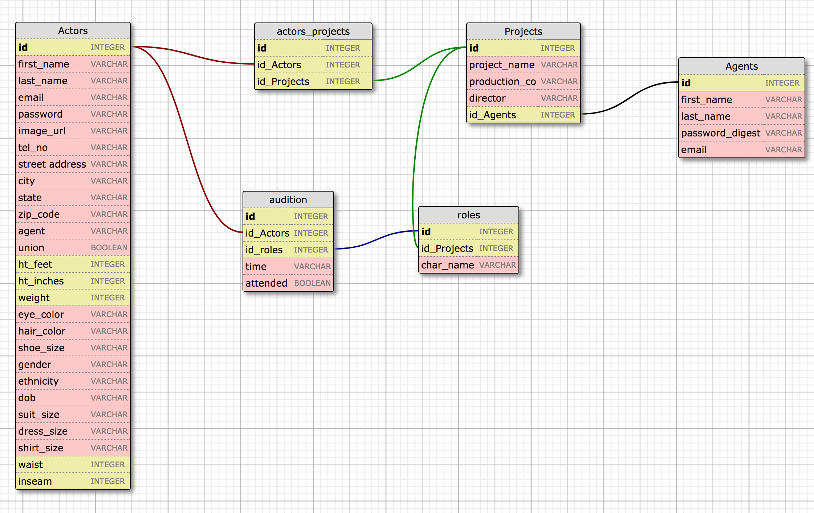

# Casting App

This is a application geared towards the theatre, film/TV casting world. It looks to help casting directors organize auditions and go paperless. The actors coming in to audtion will receive a link to register so that their info can be in the database, instead of filling out a sheet of paper at the auditions.  The casting directors can create projects, the roles for those projects and schedule the auditions for the those roles.

## User Stories

1. Actors can...
	* Register/create their profile
	* Login
	* Edit their profile

2. Casting directors can...
	* register/create their profile
	* login
	* Create/Edit/Delet a Project
	* Create/Edit/Delet a Role
	* Create/Edit/Delet a Audition

	https://trello.com/b/8C2ZAVOb/casting3

## Schema

## Technologies Used
Ruby 2.4, Rails 5, ActiveRecord, Postrgresql, HTML, CSS 

## What would I like to expand on?
* I want to build a module that handles the check in process at the audition.  Actors would click on their name, verify their info, and check-in.
* The ability for casting directors to send emails through the app.
* Casting should be able to add notes to each actor on their audition.
* Being able to compare actor profiles side by side during the decision process.

